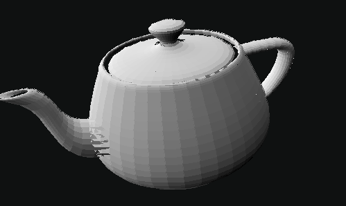

[![MIT/Apache][s3]][li]

# 3D Graphics from Scratch

A basic cpu renderer written in Rust.
This is a port loosely based in the C tutorial series by Javidx9
https://www.youtube.com/watch?v=ih20l3pJoeU

This is a work in progress, used mostly for me to understand the
aplications of linear algebra in computer graphics.

## Features

- [x] 3D Projection
- [x] 3D Meshes
- [x] Mesh Loading from .obj files
- [ ] Non-glitched rendering

## Requirements

To be able to compile it, you need to have the Rust toolchain installed. You can install the latest version of Rust from the [official website](https://www.rust-lang.org/tools/install).

### Unix

Rust recommends using rustup to install Rust. You can install it in a Unix-like OS with the following command:

```bash
curl --proto '=https' --tlsv1.2 -sSf https://sh.rustup.rs | sh
```

### Windows

Along with [other installation methods](https://forge.rust-lang.org/infra/other-installation-methods.html) you can use the rustup-init.exe installer.

## Usage

To Compile and run the project, while inside the project folder, just run:

```bash
cargo run --release
```
